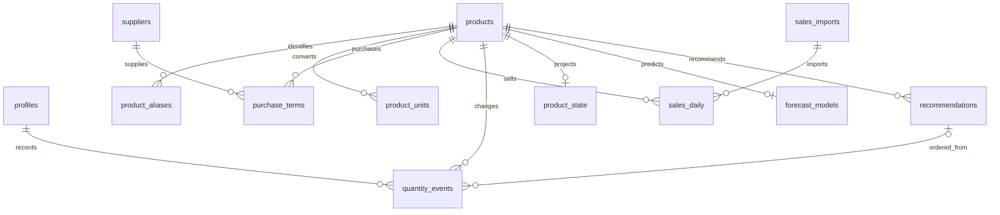

# 데이터베이스 설계

PostgreSQL 한 개로 운영한다. 약국별 멀티테넌트·데이터 웨어하우스·분산 DB는 초기 범위에 넣지 않는다. 화면의 업무는 단순하게 유지하면서 판매 중복, 단위 혼동, 정정과 동시 저장을 DB에서 처리한다.

## 공통 규칙

- 외부에 전달하는 ID는 UUID, 수량은 `numeric(14,3)`, 금액은 `numeric(14,2)`, 업무일은 `date`, 발생·등록 시각은 `timestamptz`로 한다. 날짜 계산은 `Asia/Seoul`이다. 정수 단위 품목은 소수 수량을 거부한다.
- 수량은 품목 기준 단위로 저장하고 입력 수량·입력 단위·당시 환산계수도 함께 남긴다. 나중에 포장 규격을 수정해도 과거 입고량은 변하지 않는다.
- 업무 기록은 `created_by`, `created_at`, `updated_at`, `version`을 갖는다. 취소·오입력 정정은 상태 변경과 이력으로 남기고 관련 FK를 연쇄 삭제하지 않는다.
- 계정 비밀번호는 `auth.users`가 관리한다. 아래 `profiles`에 저장하지 않는다.

## 핵심 관계

입고·발주·실사는 같은 품목의 수량 사건이므로 `quantity_events` 한 테이블에서 종류로 구분한다. 화면과 서버 함수는 각각 입고·발주·실사라는 업무 이름을 사용한다. **입고 행에 발주 행 FK는 없다.** 같은 사진에서 여러 품목을 등록하면 `batch_id`로 묶을 뿐 별도 배송 절차를 만들지 않는다.

## 테이블과 제약

| 테이블 | 주요 열 | PK·FK·제약·인덱스 |
|---|---|---|
| `profiles` | `user_id`, `display_name`, `role`, `active` | PK/FK `user_id→auth.users`; role은 admin/staff. 업무 앱에서 role·active 수정 불가 |
| `products` | `id`, `name`, `spec`, `category`, `base_unit`, `allows_fraction`, `observed_from`, `active`, `default_moq`, `default_order_step` | PK id; MOQ·step은 NULL 또는 양수; observed_from은 관측 가능 시작일이며 첫 판매일과 혼동하지 않음 |
| `product_aliases` | `id`, `product_id`, `source`, `source_code`, `alias`, `normalized_alias`, `spec` | FK product; 실제 코드가 있을 때 `(source,source_code)` 유일. 이름만 같은 경우 다중 후보 허용 |
| `product_units` | `product_id`, `unit_code`, `factor_to_base` | PK `(product_id,unit_code)`; factor>0; 기준 단위 factor=1 |
| `suppliers` | `id`, `name`, `minimum_drug_amount`, `minimum_other_amount`, `promotion_note`, `active` | PK id; 최소금액 ≥0. 주문 금액 계산용 가격은 초기 필수 아님 |
| `purchase_terms` | `product_id`, `supplier_id`, `moq_base`, `step_base`, `preferred` | PK `(product_id,supplier_id)`; 제품 기본값보다 우선. 선호 거래처는 품목당 최대 1개 |
| `sales_imports` | `id`, `file_hash`, `period_start/end`, `mode`, `status`, `object_path`, `parser_version`, `actor_id`, `expires_at` | PK id; applied 파일 해시 중복 금지. mode는 검증된 전체기간 보고서 우선. 원본 삭제 후 object_path=NULL |
| `sales_import_rows` | `import_id`, `batch_no`, `row_no`, `product_id`, `sale_date`, `net_qty` | PK `(import_id,batch_no,row_no)`; 임시 적재 테이블. 적용 후 신속 정리, 최대 30일 |
| `sales_coverage` | `sale_date`, `import_id`, `revision`, `status` | PK sale_date; 실제로 확정된 전체 자료 기간만 complete. 마지막 import 참조 유지 |
| `sales_daily` | `product_id`, `sale_date`, `net_qty`, `import_id`, `revision` | PK `(product_id,sale_date)`; net_qty는 반품으로 음수 가능. `(sale_date)` 추가 인덱스. 0행은 생략 가능 |
| `sales_rollups` | `product_id`, `retired_through`, `retired_net_qty`, `revision` | PK/FK product; 이 날짜까지 삭제한 일별 판매 누적. 백업이 아니라 현재 계산의 입력 |
| `quantity_events` | `id`, `batch_id`, `product_id`, `kind`, `qty_base`, `input_qty/unit/factor`, `occurred_at`, `recorded_seq`, `supplier_id`, `recommendation_id`, `day_boundary`, `active`, `version`, `created_by` | PK id; kind는 receipt/order/count/order_cancel/stock_adjustment; supplier·recommendation nullable. `recorded_seq`는 DB 생성 bigint. `(product_id,occurred_at,recorded_seq)` 인덱스 |
| `inventory_anchors` | `product_id`, `source_event_id`, `kind`, `anchor_date`, `sales_start_date`, `qty_base`, `sales_before_start`, `included_event_seq`, `estimated_first_day_sales`, `model_version`, `revision` | PK product; 실사/최신 입고 기준 현재 스냅샷. 과거 일별 삭제 후에도 기준일 이전 누적 판매를 재현하기 위한 값 유지 |
| `product_state` | `product_id`, `pending_qty`, `data_revision`, `last_event_seq`, `last_settled_at`, `updated_at` | PK/FK product; pending≥0. 재계산 가능한 캐시이며 입고 원천 사실을 대체하지 않음 |
| `forecast_models` | `product_id`, `model_version`, `training_start/end`, `n_observed`, `n_missing`, `coefficients`, `mae`, `wape`, `warning_codes`, `input_revision`, `computed_at` | PK product; 현재 모델 하나만 유지. 거래 근거에 쓰인 요약은 추천 기록에 보존 |
| `recommendations` | `id`, `product_id`, `status`, `decision`, `arrival_date`, `recommended_qty`, `basis_json`, `input_revision`, `version`, `created_at`, `closed_at` | PK id; status는 review/waiting/received; decision은 active/deferred/excluded. 품목별 미종결 추천 최대 1개 |
| `holiday_dates` | `holiday_date`, `name`, `source` | PK `(holiday_date,source,name)`; 날짜 제외는 중복 제거 집합으로 처리 |
| `holiday_sync_runs` | `id`, `year`, `status`, `fetched_at`, `coverage_start/end`, `last_error` | 정상 빈 결과와 조회 실패를 구분. 연도별 최신 성공 결과 선택 |
| `supplier_closed_dates` | `supplier_id`, `closed_date`, `reason` | PK `(supplier_id,closed_date)` |
| `request_receipts` | `request_id`, `actor_id`, `operation`, `payload_hash`, `result_json`, `created_at` | PK request_id; 등록 재시도 결과 보존. 성공 기록은 업무 원천과 같은 트랜잭션 |
| `audit_events` | `id`, `entity_type/id`, `actor_id`, `action`, `before/after`, `recorded_at` | 서버만 추가. 실제 변경만 기록하고 대량 판매 원문·사진을 중복 저장하지 않음 |
| `recompute_queue` | `product_id`, `required_revision`, `need_training`, `status`, `lease_until`, `attempts`, `last_error` | PK product; 같은 품목 작업 합치기. 실행 중 추가 변경 시 다음 계산을 남김 |

`quantity_events`의 receipt/order/order_cancel은 수량>0, count는 수량≥0, stock_adjustment는 0이 아닌 부호 있는 수량이다. `day_boundary`는 실사에만 적용한다. 실제 발주 취소는 당시 남은 대기량을 줄이는 order_cancel 사건으로 남기고, 처음부터 잘못 입력한 발주량은 원래 사건의 정정으로 처리한다.

`recommendations.basis_json`에는 판매자료 기준일, 기준점 종류/수량, 도착일까지의 수요, 7일 수요, 당시 MOQ·단위·모델 버전·예측 요약·경고를 저장한다. 원본 180일 배열이나 매번의 전체 화면을 복사하지 않는다. 상태 변경 이력은 audit에 남긴다.

## DB 권한

| 자료/행동 | 직원 | 관리자 | 운영 도구/정기 작업 |
|---|---|---|---|
| 활성 계정 업무 조회 | 허용 | 허용 | 필요 범위 |
| 판매·입고·실사 등록/정정 | 업무 RPC 허용 | 업무 RPC 허용 | 운영 목적 |
| 발주·발주 취소·추천 결정 | 거부 | 업무 RPC 허용 | 운영 목적 |
| 품목·거래처·휴무 설정 | 조회 | 설정 RPC 허용 | 허용 |
| 계정 발급·역할·활성 변경 | 거부 | 거부 | 지정된 마스터/개발자만 |
| 모델·대기 캐시 직접 쓰기 | 거부 | 거부 | 계산 함수만 |

전체 업무 테이블에 RLS를 켜고 anon 권한을 제거한다. 데이터 읽기는 `profiles.active`를 확인한다. 쓰기는 클라이언트의 직접 INSERT/UPDATE를 제한하고 역할 검사 RPC로만 수행한다. 운영 도구의 관리자 키를 관리자 화면에 전달하지 않는다. Realtime 역시 권한에 맞는 채널/테이블만 제공하고 역할 변경 시 재접속·캐시 초기화를 수행한다.

## 저장 과정

입고 등록은 요청 중복 확인 → 활성 계정·품목·단위 검증 → 관련 product_state 잠금 → quantity_events 추가 → 대기량·기준점 재계산 → audit/요청 결과 저장을 한 트랜잭션으로 처리한다. 여러 품목이면 ID 순서로 잠근다. 이는 서버 구현 순서이며 사용자 화면은 입고 저장 한 번이다.

판매 파일은 먼저 임시 적재하고 모든 행이 해석된 뒤 기간을 원자적으로 반영한다. 전체기간 보고서라면 기존 기간 행을 지운 뒤 새 집계를 넣는다. 새 파일에서 사라진 품목도 기존 수량이 남지 않아야 한다. 기간 revision을 검사하고 겹치는 동시 업로드는 하나씩 적용한다. 원본 파일은 별도 private Storage 객체, 처리 기록은 DB에 두며 원본 삭제 후에도 집계의 import FK는 유지한다.

## 180일 보관과 기준점

보관 기준일은 한국시간 오늘이다. 최근 180개 판매 날짜 밖으로 나가는 행을 제품별로 합산해 `sales_rollups`에 더하고 같은 트랜잭션에서 지운다. 기준점에 저장된 `sales_before_start`는 유지한다. 기준일 D의 누적 판매 C(D)는 해당 구간을 제공하는 rollup과 남은 daily 합계이며, 기준점 이후 판매는 `C(D)-sales_before_start`다.

예를 들어 기준일 이전 누적 판매가 1,000, 현재 누적 판매가 1,080이면 차감 판매량은 80이다. 오래된 daily 행을 지워 rollup으로 옮겨도 두 누적값의 차이는 80이어야 한다. 기준점 이전 판매가 정정되면 현재 누적값과 해당 기준점의 누적 스냅샷을 함께 조정한다. 기준점 이후 판매 정정은 현재 누적값만 바뀐다.

이미 삭제된 구간에 새로운 과거 기준점을 만들 때 누적 경계를 알 수 없으면 자동 재구성하지 않는다. 확인된 조정값이나 새 실사로 기준을 잡는다. 보관 범위를 벗어난 파일은 일반 기간 교체로 재적재하지 않고 별도 과거 정정으로 처리해 rollup과 중복 합산하지 않는다. 업무 시작일은 같아도 시점 경계가 다른 실사는 [상세 알고리즘](상세_알고리즘_설계.md)을 따른다.

## 용량 관리

1,000품목×180일은 최대 180,000개의 일별 조합이다. 0행을 생략하면 실제 행 수는 줄어든다. 품목 수가 5,000이면 최대 900,000조합이므로 사용자 5명이라는 이유만으로 DB 용량이 작다고 단정하지 않는다. 초기 데이터 적재 후 테이블·인덱스 합산 크기를 실제로 측정한다.

원본·임시행은 최대 30일, 일별 집계는 180일, 회귀계수는 품목당 최신값, 미발주 추천의 오래된 계산 결과는 최신값으로 교체한다. 발주와 연결된 추천 근거, 수량 사건, 계산 기준점은 유지한다. 이력 보관이 커지면 별도 압축 정책을 결정하며 조용히 삭제하지 않는다. 비용 한도에 맞추기 위해 필수 자료를 임의로 잘라내지 않는다. 별도 DB 백업은 만들지 않는다.

초기 마이그레이션은 ① 계정·품목 ② 판매 ③ 수량 기록·캐시 ④ 예측·휴일 ⑤ 권한·RPC 순서로 작성한다. 스키마 설계만으로 RLS와 동시 저장이 검증됐다고 보지 않으며 실제 DB 시험을 거친다.
