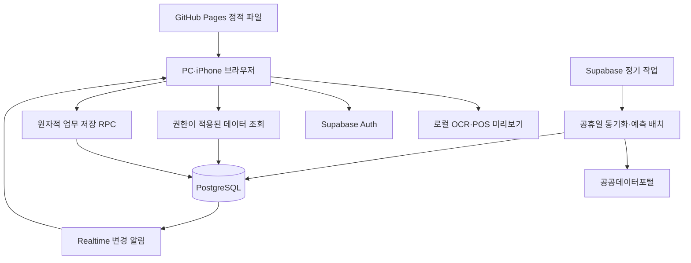

# 시스템 구조 설계

[개발 계획](개발계획.md)과 [요구사항 명세](소프트웨어_요구사항_명세서.md)를 따른다. 한 약국의 약 5명이 사용하는 중앙 데이터 방식으로 설계한다.

## 구성



GitHub Pages는 빌드된 정적 파일만 제공한다. 업무자료는 Supabase에 저장한다. 브라우저가 계산한 잔량·대기량을 그대로 DB에 쓰지 않고 서버에서 검증·계산한다. OCR 이미지는 브라우저 메모리에서 처리한다. POS 원본은 검증 필요 시 비공개 파일 저장소에 최대 30일 보관할 수 있지만, 입고 사진용 업로드 경로는 만들지 않는다.

## 프론트엔드

React·TypeScript·Vite를 사용하고 페이지 이동은 `/#/review`, `/#/receipts`, `/#/sales`, `/#/settings`와 같은 해시 경로를 기본으로 한다. GitHub Pages의 하위 경로는 `/pharmacy-purchase-assistant/`를 빌드 설정에 반영한다. 이 조합은 정적 호스팅에서 새로고침 경로 오류를 줄이며, 이후 호스팅을 옮겨도 API와 도메인 설정을 바꾸면 같은 빌드를 사용할 수 있다. [Vite 정적 배포](https://vite.dev/guide/static-deploy)

화면별 모듈은 다음과 같다.

| 모듈 | 책임 |
|---|---|
| 인증 | 로그인·로그아웃, 활성 계정 확인, 권한에 맞는 메뉴 |
| 판매 업로드 | 파일 해석, 기간·열 매핑 미리보기, 품목 매칭, 일별 자료 저장 |
| 입고 | 촬영·로컬 OCR·품목/수량 확인·저장. 수동 입력 포함 |
| 사입 검토 | 표·검색·정렬·추천 근거, 수량 수정, 실제 발주 완료 |
| 입고 대기·이력 | 품목별 대기 수량, 입고 반영 내역, 추가 발주 및 정정 |
| 설정 | 품목·단위·MOQ·거래처·휴무일 |

TanStack Query는 서버 데이터와 재조회 상태, React의 로컬 상태는 입력 중인 값·선택 행을 관리한다. 변경 알림을 받으면 관련 조회만 무효화하고 사용자가 수정 중인 입력값·스크롤·선택을 유지한다. 일반 조회와 현재 입력 상태를 같은 저장소 객체로 덮어쓰지 않는다. 탭 복귀·재연결 시 전체 최신 버전을 확인한다.

관리자 화면은 상단 검색·판매자료 기준일, 중앙 품목 표, 선택 행의 근거 영역으로 구성한다. 다크/라이트 테마, 숫자 우측 정렬·동일 폭 숫자, 키보드 탐색을 제공한다. 직원 iPhone에서는 촬영과 품목·수량 입력을 크게 배치한다. 색상만으로 상태를 전달하지 않으며 일반 조작 영역은 44px 이상으로 한다.

## 인증과 서버 경계

Supabase Auth의 이메일·비밀번호 계정을 마스터/백엔드 개발자가 운영 스크립트나 대시보드에서 발급한다. 공개 가입은 꺼 둔다. `profiles`에는 사용자 ID·이름·업무 역할·활성 여부만 저장한다. 마스터는 운영 도구 접근 주체이고 앱에 별도의 세 번째 역할을 만들지 않는다.

일반 업무 요청은 사용자의 JWT로 실행한다. 읽기에는 RLS와 최소 조회 권한을, 쓰기에는 허용된 RPC를 적용한다. RPC는 호출자의 활성 여부와 역할을 DB에서 다시 확인한다. `SECURITY DEFINER`가 필요한 원자적 쓰기 함수는 고정된 `search_path`, 완전한 스키마명, 명시적 권한 검사와 실행 권한 제한을 둔다. 원천 테이블의 직접 쓰기는 클라이언트에게 허용하지 않는다. 조회 뷰는 호출자 권한이 적용되도록 작성한다. [Supabase RLS](https://supabase.com/docs/guides/database/postgres/row-level-security)

서비스 관리자 키는 계정 발급과 정기 서버 작업에만 사용한다. 클라이언트가 요청 본문에 보낸 역할·등록자·작성 시각을 권한 근거로 믿지 않는다. 비활성화는 `profiles.active=false`와 Auth 세션 조치를 함께 수행하며, 기존 JWT가 남아 있어도 다음 업무 요청에서 차단한다. 로그아웃·비활성 통지 시 화면의 업무 캐시도 비운다.

## API와 트랜잭션

외부에는 Supabase의 인증·읽기 API와 아래 업무 RPC를 제공한다. 명칭은 설계안이다.

| RPC/함수 | 입력 요점 | 결과·처리 |
|---|---|---|
| `begin_sales_import` | 기간, 파일 해시, 전체/증분 형식 | 업로드 ID 생성·중복 확인 |
| `stage_sales_rows` | 업로드 ID, 배치 번호, 정규화 행 | 임시 행 적재, 같은 배치 재시도 중복 방지 |
| `commit_sales_import` | 업로드 ID, 기대하는 기간 버전 | 기간 전체를 원자적으로 교체하고 변경 품목 재계산 예약 |
| `register_receipt` | request ID, 실제 입고일시, 품목·단위·수량 | 입고 저장·단위 환산·대기량 갱신 |
| `register_stock_count` | request ID, 품목, 시점, 실제 수량 | 실사 저장·계산 기준 갱신 |
| `confirm_order` | request ID, 추천 ID/버전, 품목·거래처·실제 수량 | 관리자 검사·실제 발주 기록·대기량 갱신 |
| `revise_document` | 대상 ID·버전·수정값 | 권한 검사, 정정 이력, 해당 품목 재계산 |
| `save_product_settings` | 품목·거래처 조건·버전 | 관리자 검사·설정 변경 |
| `refresh_forecasts` | 서버 내부 배치 범위 | 회귀 결과와 추천 캐시 갱신 |
| `sync_holidays` | 서버 내부 연도 범위 | 공식 휴일과 조회 완료 범위 갱신 |

업무 RPC는 `request_id`와 요청 내용 해시를 기록한다. 같은 ID·같은 내용 재시도에는 기존 성공 결과를 반환하고, 같은 ID·다른 내용에는 충돌을 반환한다. 입고 여러 품목은 한 번의 저장 트랜잭션으로 처리한다. 관련 품목의 상태 행을 품목 ID 순서로 잠가 동시 입고·발주를 직렬화한다. 응답 손실 후 재시도도 중복 저장되지 않는다.

조회·정정은 `version`을 사용한다. 다른 사용자가 이미 바꾼 값에는 충돌 응답을 보내고 입력을 보존한 채 최신 값을 보여준다. HTTP 오류 의미는 인증 401, 권한 403, 입력 422, 버전 충돌 409, 외부 장애 503에 대응시킨다. RPC의 내부 오류 코드도 같은 사용자 메시지로 매핑한다.

## 계산과 정기 작업

1. 판매 집계 변경 시 해당 품목을 재학습 대상으로 표시한다. 입고·실사·발주만 바뀌면 기존 회귀계수를 재사용하고 추천만 갱신한다.
2. `recompute_queue`에서 품목별 작업을 합치고 작은 배치로 처리한다. 첫 배치는 20품목으로 시작해 실측 조정한다. 오래된 입력 버전으로 계산한 결과는 최신 결과를 덮어쓰지 않는다.
3. 매일 한국시간 02:00에 공휴일 동기화, 03:00에 만료 원본 정리·판매 이월을 수행한다. 자정에는 주문일 변경에 따른 추천을 갱신한다. 판매 업로드 후 계산은 스케줄을 기다리지 않고 실행을 요청한다.
4. 작업 실패 시 DB의 미완료 항목을 남겨 다음 실행에서 이어간다. 중복 실행 잠금·재시도 횟수·마지막 오류를 기록한다. 경고를 없애려고 서버를 의미 없이 호출하는 유지용 작업은 만들지 않는다.

Supabase Edge Functions에는 CPU·메모리·실행 시간 제한이 있으므로 1,000품목을 한 요청에서 모두 학습시키지 않는다. 공식 문서의 현재 제한은 CPU 요청당 2초, 메모리 256MB, 무료 실행 수명 150초다. 배치 CPU 시간을 측정하고 초과 시 배치를 더 작게 나눈다. 초기 목표는 1,000품목 전체 갱신 5분 이내이며 검증 전 보장값으로 표시하지 않는다. [실행 제한](https://supabase.com/docs/guides/functions/limits)

## 소스 구조와 배포

```text
src/
  app/                 로그인·레이아웃·경로
  features/            sales, receipts, review, settings
  components/          표·입력·상태 표시
  lib/                 Supabase 연결·단위·날짜·검증
  workers/             로컬 OCR·POS 파일 해석
supabase/
  migrations/          테이블·인덱스·RLS·RPC
  functions/           holiday-sync, forecast-batch
  tests/               권한·거래 처리 시험
tests/                 알고리즘·브라우저 시험
scripts/               계정 발급·운영 점검
docs/                  요구사항·설계·운영 설명
```

브라우저 설정은 Supabase URL과 publishable key 등 공개 가능한 값만 포함한다. 공휴일 API 키·관리자 키는 서버 환경변수에 저장한다. 공개 저장소 Actions에서 앱을 빌드하고 정적 결과만 Pages에 배포한다. 프론트 빌드 과정에 DB 관리자 키를 제공하지 않는다. 호스팅 정책 적합성은 [개발 계획](개발계획.md)의 운영 전 확인 사항을 따른다.

프로젝트는 무료 운영이며 별도 DB 백업은 없다. 장애 시 사용자는 수동 발주를 하고 개발자는 Supabase 대시보드의 일시정지 여부, Resume 가능 여부, 인증·DB·서버 함수·정기 작업을 순서대로 확인한다. 재개 후 휴일 캐시와 마지막 판매일을 점검하고, 장애 기간의 입고·발주는 실제 발생일로 다시 등록한다. 이 절차를 실제 프로젝트 화면 기준으로 운영 문서에 완성한다. [프로젝트 일시정지](https://supabase.com/docs/guides/platform/free-project-pausing)
